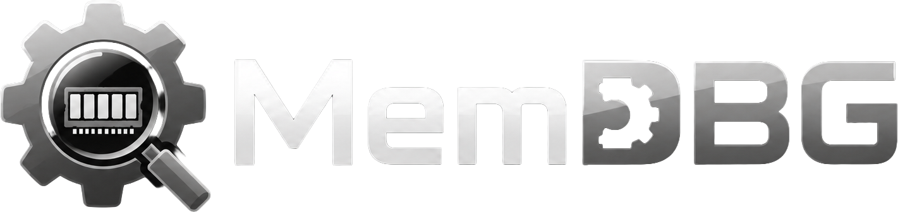

<div align="center">

<br/>



<br/>
<br/>

**Memory debugging and inspection suite for PS4 / PS5 research environments.**

<br/>

[](LICENSE)
[](#supported-platforms)
[](#repository-status)
[](https://github.com/seregonwar/MemDBG/releases)
[](#building)

<br/>

</div>

---

MemDBG is a high-performance memory debugging suite for PlayStation 4 and PlayStation 5 homebrew research. It pairs a compact, capability-aware wire protocol running on the console with a native Dear ImGui frontend, giving you a unified interface for process inspection, memory analysis, scanning, and cheat-trainer workflows — without compromising on speed or ergonomics.

> Intended for educational, research, preservation, and offline homebrew development purposes only.

<br/>

## Table of Contents

- [Highlights](#highlights)
- [Architecture](#architecture)
- [Features](#features)
- [Quick Start (host)](#quick-start-host)
- [Quick Start (PS5)](#quick-start-ps5)
- [Comparison](#comparison)
- [Wire Protocol](#wire-protocol)
- [Supported Platforms](#supported-platforms)
- [Localization](#localization)
- [Plugins and Scripting](#plugins-and-scripting)
- [Building](#building)
- [Testing](#testing)
- [Workflow](#workflow)
- [Configuration](#configuration)
- [Release Pipeline](#release-pipeline)
- [Contributing](#contributing)
- [Ethical Use](#ethical-use)
- [Disclaimer](#disclaimer)
- [License](#license)

<br/>

## Highlights

- **Single-binary payload** for PS4 (Orbis) and PS5 (Prospero), plus a Linux/macOS host build for offline development.
- **Native desktop frontend** in C++17 with Dear ImGui, OpenGL, and GLFW — packaged as `.app` on macOS, `.exe` on Windows, and a `.desktop` entry on Linux.
- **Capability-aware protocol** — the frontend adapts gracefully to older or partial payloads without crashing.
- **Six payload scanner paths**: range exact, process-wide exact, range AOB, process-wide AOB, pointer chain, and unknown initial value, plus a heuristic **Smart Auto-Search** engine tuned for common game values (health, ammo, resources).
- **Native debugger core** with attach/detach, stop/continue/step, thread control, software breakpoints, hardware breakpoints/watchpoints, register access, stack walking, and compact disassembly.
- **Non-blocking UI** — connect, scan, and telemetry requests run on worker threads and stream results back via `std::future` polling.
- **Repository-backed localization** — English is embedded, while additional languages are listed, downloaded, validated, and cached from the project repository.
- **Lua / Python plugin system** — desktop-side scripts install from  `manifest.json` repositories, with a forkable default source at `seregonwar/MemDBG-Plugin` and a bundled local fallback under `plugin-repository/`.
- **Embeddable library target** (`libmemdbg.a`) for integrating the payload core into other tools.
- **Zero-config discovery** — payloads respond to UDP broadcasts so the frontend can auto-populate the console list without hardcoding a debug port.
- **Crash-resilient logging** — ring-buffered event log with signal-safe crash handlers; survives `SIGSEGV`/`SIGABRT`/`SIGFPE`/`SIGILL` and flushes to disk immediately. Captures frontend status, notifications, and UDP console logs.
- **DPI-aware UI** — auto-detects monitor content scale on startup and scales every widget, font, and layout proportionally for HiDPI / Retina displays.

<br/>

## Architecture

```
MemDBG
├── payload/                  C11 homebrew daemon (PS4, PS5, host)
│   ├── core/
│   │   ├── daemon/           TCP protocol daemon and command dispatch
│   │   └── *.c               Entry point, instance lifecycle, logging
│   ├── scanner/
│   │   ├── engine/           Exact, AOB, pointer, unknown + process-wide scans
│   │   └── scan_partition.*  Host-tested scan map partitioning
│   ├── debug/
│   │   ├── session/          Debug attach/stop/step, breakpoints, watchpoints
│   │   ├── memory/           Telemetry-aware memory read/write wrappers
│   │   └── process/          Process metadata, map cache, map enrichment
│   ├── privilege/            Sandbox escape + per-process elevation
│   ├── telemetry/            UDP broadcast logger + discovery responder
│   └── pal/                  Platform abstraction (network, memory, kernel, debug, fileio, notify, lz4)
├── libmemdbg.a               Static library target (PS4 / PS5) for embedded use
├── memdbg-host               Host validation build (same C sources, host toolchain)
└── frontend/                 C++17 + Dear ImGui desktop app
    ├── app/
    │   ├── shell/            Window, sidebar, top bar, status bar, async dispatch
    │   └── app_state.hpp     Shared UI/session state
    ├── core/
    │   ├── client/           TCP protocol client
    │   └── *.cpp             UDP listener, release checks, GitHub profile loader
    ├── screens/              Feature folders for Home, Debugger, Plugins, Scanner, …
    ├── scanner/
    │   └── heuristics/       Auto-Search heuristic engine
    ├── trainer/              .cht load/save, batchcode parser
    ├── plugins/
    │   └── repository/       Plugin sources, manifests, install/update/run
    ├── locale/               English embedded i18n plus repository-backed language cache
    ├── ui/                   Reusable widgets, theme, fonts, icon font, file picker
    └── proto/                Standalone protocol probe CLI
```

The payload binds a TCP debug port and exposes process enumeration, map inspection, and memory primitives; it streams runtime logs over UDP. The frontend connects to the TCP endpoint, subscribes to telemetry, and renders the full interactive interface. Payloads advertise their capabilities via a bitmap in the `HELLO` response, so the frontend can hide unsupported features rather than erroring.

<br/>

## Quick Start (host)

**Run MemDBG on your laptop in under 5 minutes — no console required.**

The host validation build is a full protocol server (`MemDBG-host`) that opens real TCP/UDP sockets and serves the identical wire protocol as the console payload. You can explore every screen in the frontend without needing a jailbroken PS4 or PS5.

### 1. Prerequisites

- **C11 compiler** (`cc`, `clang`, or `gcc`)
- **CMake 3.24+** and a C++17 toolchain
- **macOS** or **Linux** (the host build works on both)

```sh
which cc cmake     # both should resolve
```

### 2. Build the host payload (one command)

```sh
make host
```

Compiles every C source from `src/` with the host toolchain into a single binary: `build/MemDBG-host`.

### 3. Build the frontend (one command)

```sh
make frontend
```

The CMake build pulls in Dear ImGui, GLFW, and nlohmann/json via `FetchContent` and produces a native binary:

| OS | Binary |
|---|---|
| macOS | `build/frontend/bin/MemDBG.app` |
| Linux | `build/frontend/bin/memdbg_frontend` |

### 4. Start both in two terminals

**Terminal 1 — payload server:**

```sh
./build/MemDBG-host --bind=127.0.0.1 --debug-port=9020 --udp-port=9023 --data-root=/tmp/MemDBG
```

The payload logs its startup to stdout: `MemDBG <version> starting debug=127.0.0.1:9020 udp_log=127.0.0.1:9023 pool=4`.

**Terminal 2 — frontend:**

```sh
# macOS
open build/frontend/bin/MemDBG.app

# Linux
./build/frontend/bin/memdbg_frontend
```

### 5. Connect and explore

In the frontend, open the **Consoles** screen, enter host `127.0.0.1` and port `9020`, then press **Connect**. Once connected:

| Screen | What you can do on host |
|---|---|
| **Processes** | List your running processes, inspect memory maps, dump a map to disk. |
| **Memory** | Read/write any mapped address; try the hex view and ROP gadget finder. |
| **Scanner** | Run an exact-value scan on your own process memory. |
| **AOB Scan** | Search for byte patterns like `48 8B ?? ??` across a process. |
| **Pointer Scan** | Trace pointer chains from a target address with adjustable depth. |
| **Trainer** | Build cheat entries and save `.cht` files (addresses are real on host). |
| **Debugger** | Attach to a process, set breakpoints and watchpoints, inspect registers, step through code. (Linux works out of the box; macOS may require disabling SIP or codesigning the binary for `ptrace`.) |
| **Logs** (`F10`) | Watch the live UDP telemetry feed from the payload. |
| **Plugins** | Install and run Lua/Python scripts from the bundled `plugin-repository/`. |

> **Tip:** Hotkeys make navigation fast — `F5` Connect, `F6` Processes, `F7` Scanner, `F8` Memory, `F9` Trainer, `F10` Logs.

Want to go deeper? Run the full test suite:

```sh
make test                          # all C payload tests (host-side)
make check-locales                 # validate locale completeness
make check-headers                 # verify header-source correspondence

# Frontend unit tests:
./build/frontend/bin/memdbg_auto_search_test        # Auto-Search heuristic engine
./build/frontend/bin/memdbg_trainer_formats_test    # Trainer/batchcode parser
./build/frontend/bin/memdbg_locale_manager_test     # Locale loading & validation
```

If something doesn't work, start with `make host` and `./build/MemDBG-host` — the test suite and CI workflow both exercise this exact path.

> **One-command shortcut:** `./tools/quick_start.sh` automates all five steps above — builds, launches, and opens a tmux session with the payload and frontend side by side. Pass `--no-build` to skip the build, `--host-only` for payload only, or `--help` for all options.

<br/>

## Quick Start (PS5)

**Deploy the payload to a jailbroken PS5 and run your first memory scan in under 10 minutes.**

> **Prerequisite:** Your PS5 must be jailbroken (e.g., via [GoldHEN](https://github.com/GoldHEN)) and reachable over your local network. The PS5 Payload SDK ships with the repository under `external/ps5-payload-sdk/` — no extra SDK downloads needed.

### 1. Prerequisites

- **Jailbroken PS5** with GoldHEN or equivalent CFW enabler
- **PS5 on the same LAN** as your PC (note the PS5 IP address)
- **C11 compiler + PS5 Payload SDK** (bundled in `external/ps5-payload-sdk/`)
- **CMake 3.24+** and C++17 toolchain (for the frontend)

### 2. Build the PS5 payload

```sh
make payload-ps5
```

Produces `build/ps5/MemDBG-ps5.elf` — a single-binary payload ready for deployment.

### 3. Deploy to the PS5

```sh
make deploy-ps5 PS5_HOST=192.168.1.100 PS5_PORT=9021
```

Replace `192.168.1.100` with your PS5's actual IP address. `PS5_PORT=9021` is the payload receiver port (separate from the debug port `9020` the frontend connects to). The deploy tool sends the ELF to the console's payload receiver. You should see a notification on the PS5: "MemDBG by seregonwar started".

### 4. Build and launch the frontend

If you haven't already built the frontend (same binary as the host Quick Start):

```sh
make frontend

# macOS
open build/frontend/bin/MemDBG.app

# Linux
./build/frontend/bin/memdbg_frontend

# Windows
build\frontend\bin\MemDBG.exe
```

This produces a native Dear ImGui app — the same one used for host development, now pointing at your PS5.

### 5. Connect to the PS5

In the frontend:

1. Open the **Consoles** screen.
2. Enter your PS5's IP address (e.g., `192.168.1.100`) and the debug port `9020`.
3. Press **Connect** — the status bar turns green when the handshake completes.

> If the payload doesn't appear automatically, make sure ports `9020` (TCP) and `9023` (UDP) are open between your PC and the PS5, and that no firewall is blocking them.

### 6. Run your first scan

1. **Processes** — press **Refresh** to list running processes on the PS5. Select a game process from the dropdown.
2. **Memory Maps** — press **Maps** to load the process memory layout. Double-click a writable map to populate the scanner range.
3. **Scanner** — pick a value type (e.g., `u32` for a 32-bit integer), enter a known value (e.g., your current ammo count), and press **Scan**.
4. **Refine** — change the value in-game (shoot once), then press **Refine → Decreased**. Repeat until you have a single candidate address.
5. **Trainer** — click **Use First Hit** in the Trainer tab, give it a name, and press **Add to Trainer**. Toggle it ON to lock the value.

> **Pro tip:** Use **Smart Auto-Search → Health / Ammo / Resources** for a heuristic pass that scores candidates by common game-value patterns. This often finds your target in fewer refinement steps.

### PS5 vs Host

| Capability | Host build | PS5 payload |
|---|---|---|
| Process list / maps | ✅ (host processes) | ✅ (console processes) |
| Memory read/write | ✅ | ✅ |
| All scan types | ✅ | ✅ |
| Debugger (attach, BPs, WPs) | ✅ (Linux) / ⚠️ (macOS, SIP) | ✅ (full ptrace) |
| Kernel R/W | ❌ | ✅ |
| Console notifications | ❌ | ✅ |
| FS/GS base registers | ❌ | ✅ |
| ELF load / process hijack | ✅ (host ELFs) | ✅ (PS5 ELFs) |
| Discovery (UDP broadcast) | ✅ | ✅ |

The PS5 payload unlocks the full feature set. Develop and test on host first, then deploy to console for live game debugging.

<br/>

## Features

### Scanner engine (payload-side)

- **Exact value scan** with type selection: `u8`, `u16`, `u32`, `u64`, `f32`, `f64`, raw bytes, pointer.
- **Process-wide exact scan** with protection-mask and address-range filtering.
- **Process-wide AOB scan** with wildcard bytes (`??`) in cheat-engine signature style.
- **Range AOB scan** for targeted byte-pattern searches.
- **Pointer scan** with configurable max depth, alignment, and alignment-aware dereference.
- **Unknown initial value scan** — snapshots every aligned value as a baseline for later refinement.
- **Resilient I/O** — scans continue past faulting pages, accumulate `read_errors`, and carry pending bytes across 1 MiB chunk boundaries so cross-chunk matches are never lost.

### Frontend screens

| Screen | What it does |
|---|---|
| **Home (Command Center)** | Dashboard tiles for every workflow; live session and UDP status; recent map/hit/cheat chips. |
| **Consoles** | Direct payload session management: connect, disconnect, ping, shutdown, and start/stop the UDP log listener from one place. |
| **Processes** | Refresh the process list (PID / name / Title ID / Content ID / path), inspect memory maps, filter by protection flags, hide system maps, set a minimum-size and dump cap, dump selected or filtered maps to disk, run a basic process analysis, load or hijack ELF binaries with configurable region matching (Exact / Case-Sensitive / Regex / Full Path flags) and double-click-to-populate region name. |
| **Memory** | Address-range read/write with a hex view; byte-patch input; watchpoints (polling) with overlay marks; allocation tracking with importable event streams and double-free detection; **Exploit Lab** with ROP gadget finder and heap-spray entropy analyzer. |
| **Scanner** | Exact-value scan, process-wide scan, unknown initial value scan, refinement pipeline (changed / unchanged / increased / decreased), and **Smart Auto-Search** with target presets (Health / Ammo / Resources) and a scored candidate list. |
| **Pointer Scan** | Trace pointer chains back from a target address with adjustable depth and alignment. |
| **AOB Scan** | `48 8B ?? ??`-style pattern search with wildcards, process-wide or range mode, and per-map protection filtering. |
| **Trainer** | Build cheats (name, address, type, ON/OFF/lock); import batchcodes (`offset`, `value`, `size`, AOB tokens); capture OFF values from live memory; set per-entry lock intervals; save and load `.cht`-style trainer files. |
| **Debugger** | Attach to a process, inspect threads and GPR/debug/FPU registers, step/stop/continue, manage software breakpoints and hardware watchpoints, disassemble around live registers, walk stack frames, and view FS/GS or XSTATE-backed register blobs when the payload supports them. Patch Studio and Analysis Notebook are always available inside the debugger for reversible byte/NOP/INT3 code patches, bookmarks, notes, workspace save/load, Markdown reports, and trainer export. |
| **Plugins** | Add  plugin sources by URL, refresh manifests, install/update/remove packages, and run desktop-side Lua/Python scripts with a MemDBG JSON context. |
| **Logs** | Live UDP telemetry feed with start / stop / clear / copy; sender endpoint; bind-retry counter; received / dropped / evicted message stats. |
| **Telemetry** | Payload runtime metrics (requires `PERF_TELEMETRY` capability): uptime, active connections, thread-pool size, total read/write bytes and call counts, throughput, scan-map LRU cache hit/miss rate, last-poll age. |
| **Settings** | Persistent connection defaults (host, TCP debug port, UDP log port, dump directory), 8-language picker — written to the per-platform app config directory. |
| **Credits** | Creator info, GitHub avatar and handle loaded at runtime, license, donation and repository links. |

### Frontend ergonomics

- Global hotkeys: **F1** Home · **F5** Connect/Disconnect · **F6** Processes · **F7** Scanner · **F8** Memory · **F9** Trainer · **F10** Logs.
- Toast notifications with auto fade-out and manual dismiss.
- Sidebar grouped into **Main / Tools / Observe / System** sections.
- Top bar with live chips for session state, loaded maps, scan hits, active cheats, update state, and connection actions.
- Debugger workspace: stage patches from disassembly, bookmark code/stack/patch evidence, save notebook workspaces, and export Markdown reports for sharing reverse-engineering notes.
- GUI plugin apps open from a dedicated sidebar launcher with active-plugin status and quick access to plugin management.
- Status bar showing FPS, session state, target PID, and UDP listener stats.
- File picker for dump directory and trainer file save/load.
- Embedded logo, native window icon (`.icns` macOS · `.ico` Windows · `.desktop` Linux), and a `ResizeToFit`-friendly layout that handles live window resize.
- Full Unicode font stack: base Latin + Cyrillic ranges in the primary font, with OS-specific CJK fallback chains (Apple SD Gothic Neo / Hiragino Sans GB on macOS, Malgun Gothic / Arial Unicode MS on Windows) for Japanese, Korean, and Chinese glyphs.
- DPI-aware rendering — monitor content scale is auto-detected via GLFW; all sizes, fonts, spacings, and rounding radii scale proportionally for crisp rendering on HiDPI displays.

- Mobile shells for **iOS/iPadOS (Metal)** and **Android (OpenGL ES 3)** ship under [`mobile/`](mobile/); both reuse the desktop frontend's `draw_mobile_app()` touch layout, forward system safe areas via `set_mobile_safe_area()`, and run the same embedded Lua 5.4 plugin runtime as the desktop build.
- Release CI builds desktop artifacts for Linux, macOS, and Windows, including Windows `.exe` bundles, macOS `.app.zip` plus `.dmg`, Linux `.tar.gz`, and payload `.elf`/`.a` artifacts.
- Mobile release jobs produce the unsigned iOS `.ipa` (CMake + Xcode archive) and the Android release `.apk` (Gradle + NDK CMake) on every tag/manual dispatch.
- See [`docs/mobile_architecture.md`](docs/mobile_architecture.md) and [`docs/release_packaging.md`](docs/release_packaging.md) for the implementation contract.

<br/>

## Comparison

MemDBG is not the only debugging tool in the PlayStation homebrew ecosystem. The tables below compare it against the two most direct debugger payloads — [ps5debug-NG](https://github.com/OpenSourcereR-dev/ps5debug-NG) and [ps4debug](https://github.com/GoldHEN/ps4debug).

> **Note on other tools:** [GoldHEN](https://github.com/GoldHEN) is a CFW/homebrew enabler (not a debugger) — it provides the jailbreak environment that makes payloads like MemDBG, ps5debug-NG, and ps4debug possible. [libdebug](https://github.com/GoldHEN/libdebug) is a Python/C# client library that wraps the ps4debug/ps5debug wire protocols; it is not a payload itself.

### Payload-level comparison (what runs on the console)

| Feature | **MemDBG** | [ps5debug-NG](https://github.com/OpenSourcereR-dev/ps5debug-NG) | [ps4debug](https://github.com/GoldHEN/ps4debug) |
|---|---|---|---|
| **Platforms** | PS4 · PS5 · Linux · macOS (host) | PS5 only | PS4 only |
| **Architecture** | C11 daemon, injected as standalone payload or library | C, injected as `SceShellCore` thread | C, injected as userland server |
| **Wire protocol** | Custom `MDBG` binary protocol, capability-aware, LZ4 compression | `ps5debug` wire protocol v1.0b5 | `ps4debug` wire protocol |
| **Embeddable library** | ✅ `libmemdbg.a` (PS4 + PS5) | ❌ | ❌ |
| **Host validation build** | ✅ Linux/macOS host build for offline dev and CI testing | ❌ | ❌ |
| **Process management** | List, info, maps, stop/continue/kill, protect, alloc/free | List, info, maps, attach control via ptrace | List, info, maps, basic control |
| **Memory I/O** | Single + batch read/write (64 items/call), LZ4 framing | Single + "Turbo" batch read/write | Single read/write |
| **Scanner — exact value** | ✅ u8/u16/u32/u64/f32/f64/bytes/pointer, range + process-wide | ✅ via client-side tools | ✅ via client-side tools |
| **Scanner — AOB** | ✅ Wildcard byte-pattern, range + process-wide | ✅ via client-side tools | ✅ via client-side tools |
| **Scanner — unknown value** | ✅ Baseline snapshot + refinement pipeline | ✅ via client tools | ❌ |
| **Scanner — pointer chain** | ✅ Configurable depth + alignment | ✅ via client tools | ❌ |
| **Scanner — SIMD acceleration** | ✅ AVX2/SSE exact-match fast paths (runtime-detected) | ✅ AVX2 "TurboScan" paths | ❌ |
| **Scanner — server-resident (FlashScan)** | ✅ Snapshot-based iterative scanning with on-disk spill, alias-accelerated rescans, and parallel workers | ✅ Server-resident session scanning | ❌ |
| **Smart Auto-Search** | ✅ Heuristic engine with Health/Ammo/Resources presets and scored candidates | ❌ | ❌ |
| **Debugger — attach/detach** | ✅ Full lifecycle (attach, detach, stop, continue, step) | ✅ Full lifecycle | ✅ Full lifecycle |
| **Debugger — threads** | ✅ Enumerate, suspend, resume, signal info | ✅ Enumerate, suspend, resume | ✅ Basic thread control |
| **Debugger — breakpoints** | ✅ SW + HW breakpoints, conditional BP (reg + op + value), persistent save/load `.mbp` | ✅ SW + HW breakpoints (30 SW slots, 4 HW slots) | ✅ SW + HW breakpoints |
| **Debugger — watchpoints** | ✅ Exec/read/write/RW, persistent save/load `.mwp` | ✅ 4 hardware watchpoint slots | ✅ Hardware watchpoints |
| **Debugger — registers** | ✅ GPR, debug regs, FPU/YMM, FS/GS base (capability-gated) | ✅ GPR, debug, FPU, FS/GS | ✅ Basic register access |
| **Debugger — stack walk** | ✅ Server-side RBP walk with per-frame code/stack windows | ✅ Stack walk via client | ❌ |
| **Debugger — disassembly** | ✅ Integrated x86-64 decoder, CFG view, register-based navigation | ✅ Zydis disassembler (client-side) | ❌ |
| **Debugger — assembler** | 🛠 Planned (Keystone integration tracked in feature research) | ✅ Keystone assembler embedded in payload | ❌ |
| **Debugger — Patch Studio** | ✅ Reversible byte/NOP/INT3 patches, mprotect-assisted writes, manifest save/load, trainer export | ❌ | ❌ |
| **Debugger — Analysis Notebook** | ✅ Bookmark code/stack/patch evidence, Markdown report export, workspace save/load | ❌ | ❌ |
| **Kernel access** | ✅ Base discovery, kernel R/W (capability-gated, PS4/PS5 only) | ✅ Kernel R/W, klog forwarder | ✅ Kernel R/W (PS4) |
| **Console notifications** | ✅ System notification, kernel-console print, platform-supported reboot | ✅ System notification | ✅ Basic notification |
| **ELF load / hijack** | ✅ Load ELF into target, spawn threads, region matching (Exact/Case-Sensitive/Regex/FullPath) | ✅ ELF load and remote call | ✅ ELF load |
| **Remote function call** | 🛠 Protocol reserved, returns `UNSUPPORTED` | ✅ `call()` support | ❌ |
| **Discovery** | ✅ Zero-config UDP broadcast/pong auto-detection | ✅ via client tools | ❌ |
| **UDP telemetry / logging** | ✅ Ring-buffered event log, crash-resilient, signal-safe flush | Klog stream (no UDP log) | ❌ |
| **Rest-mode resilience** | 🛠 Planned | ✅ Auto-restarting supervisory loop | ❌ |

### Client-side comparison (what runs on your PC)

| Feature | **MemDBG Frontend** | Typical ps5debug/ps4debug clients |
|---|---|---|
| **UI framework** | Native C++17 + Dear ImGui (OpenGL/GLFW), DPI-aware, HiDPI fonts | Python/C# GUI tools (e.g., PS4 Cheater, Reaper Studio, custom clients) |
| **Desktop platforms** | Windows · macOS · Linux (`.app`/`.exe`/`.desktop` bundles) | Varies (mostly Windows) |
| **Mobile shells** | ✅ iOS/iPadOS (Metal) + Android (OpenGL ES 3) | ❌ |
| **Non-blocking async UI** | ✅ `std::future`-based worker threads, streaming scan results | Client-dependent |
| **Localization (i18n)** | ✅ 9 languages (en/es/it/fr/pt/de/ja/ru/ko), repository-backed cache, validation tooling | ❌ |
| **Plugin system** | ✅ Lua 5.4 / Python scripts, repository-backed install/update, JSON context API | ❌ (GoldHEN has plugin system but for console, not debugger) |
| **Trainer builder** | ✅ Cheat entries with ON/OFF/lock, batchcode import, `.cht` save/load, trainer export from Patch Studio | Client-dependent |
| **Workspace persistence** | ✅ Settings saved per-platform, breakpoint/watchpoint files, notebook workspaces, patch manifests | Client-dependent |
| **Protocol probe CLI** | ✅ Standalone `memdbg_probe` for exercising the payload without GUI | ❌ |
| **Release packaging** | ✅ CI pipeline: 9 artifacts (desktop + payload + mobile), SHA256SUMS, locale validation gate | Varies |

### When to use what

| Use case | Recommendation |
|---|---|
| You want a single tool that works on **both PS4 and PS5** with a unified frontend | **MemDBG** |
| You need **in-console assembler** (Keystone) for live code patching | ps5debug-NG (MemDBG has this on the roadmap) |
| You need **remote function call** (`call()`) support | ps5debug-NG |
| You need **rest-mode resilience** on PS5 | ps5debug-NG |
| You want a **native desktop frontend** with HiDPI, i18n, and plugin scripting | **MemDBG** |
| You want **Patch Studio + Analysis Notebook** for reversible code patching with evidence tracking | **MemDBG** |
| You use **existing PS4 cheater clients** and need wire compatibility | ps4debug |
| You want a **mobile debugging interface** on iPad or Android | **MemDBG** |
| You want **offline host development** without a console (CI, testing, bring-up) | **MemDBG** |
| You want a **fully localized UI** in your language | **MemDBG** |

> **Note:** MemDBG, ps5debug-NG, and ps4debug all require the console to be jailbroken (e.g., via GoldHEN or equivalent). None of these tools can operate on a stock/unmodified retail console.

<br/>

## Wire Protocol

A compact binary protocol (`MEMDBG_PACKET_MAGIC = "MDBG"`, little-endian, version 1). All multi-byte fields are packed. Payloads declare capabilities via the `HELLO` response bitmap, so the frontend stays forward-compatible with older or platform-specific builds.

### Limits

| Constraint | Value |
|---|---|
| Max packet size | 1 MiB |
| Max `MEMORY_READ` size | 1 MiB |
| `BATCH_READ` / `BATCH_WRITE` items per call | 64 |
| Max scan value payload | 16 bytes |
| Max extended register blob | 1024 bytes (`DEBUG_FPREGS`; flag `0x1` means XSTATE/XSAVE layout) |
| Optional result compression | LZ4 (advertised via `MEMDBG_CAP_LZ4`) |

### Commands

| Code | Command | Purpose |
|---|---|---|
| `0x0001` | `HELLO` | Capability bitmap, platform ID, version, debug/UDP ports. |
| `0x0002` | `PING` | Liveness probe. |
| `0x0100` | `PROCESS_LIST` | Enumerate all PIDs. |
| `0x0101` | `PROCESS_MAPS` | Memory map list for a PID. |
| `0x0102` | `PROCESS_INFO` | Name, executable path, Title ID, Content ID. |
| `0x0103` | `FOREGROUND_APP` | Metadata for the currently focused application. |
| `0x0104` / `0x0105` | `PROCESS_STOP` / `PROCESS_CONTINUE` | Suspend / resume a target process. |
| `0x0108` | `PROCESS_PROTECT` | Change target process memory protection. |
| `0x0109` / `0x010A` | `PROCESS_ALLOC` / `PROCESS_FREE` | Protocol endpoints for remote allocation lifecycle; platforms without a safe syscall bridge return `UNSUPPORTED`. |
| `0x010B` | `PROCESS_STACK` | Server-side RBP stack walk, including stack and code windows per frame. |
| `0x010C` | `PROCESS_CALL` | Reserved remote execution endpoint; validates requests and returns `UNSUPPORTED`. |
| `0x010D` | `PROCESS_ELF_LOAD` | Load an ELF binary into a target process, optionally matching a VM region by name. Supports `target_region` with wildcards (`*`), substring fallback, and `match_flags`: `EXACT` (0x1), `CASE_SENSITIVE` (0x2), `REGEX` (0x4 — POSIX ERE), `FULLPATH` (0x8 — match full path instead of basename). |
| `0x010E` | `PROCESS_HIJACK` | Inject an ELF payload by spawning a thread inside the target process, with the same `target_region` and `match_flags` controls. Bit 0 of flags = spawn thread, bit 1 = resume target after injection. |
| `0x0200` / `0x0201` | `MEMORY_READ` / `MEMORY_WRITE` | Single-address I/O. |
| `0x0202` / `0x0203` | `BATCH_READ` / `BATCH_WRITE` | Multi-address I/O in one round-trip (used by Auto-Search and trainer lock writes). |
| `0x0300` / `0x0301` | `SCAN_EXACT` / `SCAN_PROCESS_EXACT` | Value scan, range or process-wide. |
| `0x0302` / `0x0305` | `SCAN_AOB` / `SCAN_PROCESS_AOB` | Byte-pattern scan, range or process-wide. |
| `0x0303` | `SCAN_POINTER` | Pointer-chain search. |
| `0x0304` | `SCAN_UNKNOWN` | Baseline every aligned value for later refinement. |
| `0x0400` | `TELEMETRY` | Runtime performance metrics. |
| `0x0500` | `DISCOVERY` | UDP broadcast ping/pong for console auto-detection. |
| `0x0600`-`0x0619` | `DEBUG_*` | Attach/detach, stop/continue/step, thread control, GPR/debug/FPU register access, breakpoints, watchpoints, and event polling. |
| `0x0800`-`0x0802` | `KERNEL_*` | Kernel base discovery and kernel memory read/write on supported console payloads. |
| `0x0900`-`0x0902` | `CONSOLE_*` | System notification, kernel-console print, and platform-supported reboot. |
| `0x7f00` | `SHUTDOWN` | Clean payload termination. |

Every `SCAN_*` response opens with a `memdbg_scan_response_prefix_t` carrying hit count, truncation flag, bytes scanned, elapsed time, and read/region/error counts — the same numbers the frontend surfaces on screen.

<br/>

## Supported Platforms

| Platform | Status |
|---|---|
| PlayStation 5 | Supported (`make payload-ps5`) |
| PlayStation 4 | Supported (`make payload-ps4`) |
| Linux host | Supported |
| macOS host | Supported |
| Windows host + frontend | Supported |
| Frontend — Linux | Supported |
| Frontend — macOS | Supported (universal `.app` bundle) |
| Frontend — Windows | Supported (`.exe` + `.ico`) |
| Mobile — iOS / iPadOS | Supported (Metal + Dear ImGui, `.ipa`) |
| Mobile — Android | Supported (OpenGL ES 3 + Dear ImGui, `.apk`) |

The frontend connects to the payload over TCP (default port `9020`). Telemetry and discovery use UDP (`9023` and `9022` respectively). The host build requires all three ports to be free at startup.

<br/>

## Localization

The UI is driven by JSON locale files in [`frontend/locales/`](frontend/locales). English (`en.json`) and `imgui.ini` are embedded at build time via `tools/embed_assets.py`; every other language is fetched from the repository through [`manifest.json`](frontend/locales/manifest.json), stored under the platform app data directory, validated, and preloaded on startup. When a cached language differs from the repository version or fails JSON validation, the frontend redownloads it before loading it into memory.

Adding a new language is as simple as dropping a `<code>.json` file, regenerating the manifest, and opening a PR — `make check-locales` will flag missing keys, stale manifest size/hash data, and format-string mismatches before the build ships.

| Code | Language | File |
|---|---|---|
| `en` | English | [`en.json`](frontend/locales/en.json) |
| `es` | Español | [`es.json`](frontend/locales/es.json) |
| `it` | Italiano | [`it.json`](frontend/locales/it.json) |
| `fr` | Français | [`fr.json`](frontend/locales/fr.json) |
| `pt` | Português | [`pt.json`](frontend/locales/pt.json) |
| `de` | Deutsch | [`de.json`](frontend/locales/de.json) |
| `ja` | 日本語 | [`ja.json`](frontend/locales/ja.json) |
| `ru` | Русский | [`ru.json`](frontend/locales/ru.json) |

```sh
make check-locales   # fails if any locale is missing a key present in en.json
make check-headers   # verifies every include/memdbg/ header has a matching source file
python3 tools/generate_locale_manifest.py
```

<br/>

## Plugins and Scripting

The frontend includes a plugin manager for desktop-side Lua and Python scripts.
Plugin sources are repositories with a `manifest.json` package list; the default
source is [`seregonwar/MemDBG-Plugin`](https://github.com/seregonwar/MemDBG-Plugin),
and this checkout carries a bundled fallback copy in [`plugin-repository/`](plugin-repository).

In **Plugins** you can add a GitHub repository URL, a raw manifest URL, or a
local folder/file path, then refresh, install, update, remove, enable/disable,
and run packages. Scripts receive a JSON context file with the active console,
selected PID, process name, dump/trainer paths, map count, scan hits, trainer
entry count, protocol version, and payload capabilities.

To publish your own plugins, fork the default repository, add scripts under
`plugins/`, edit `manifest.json`, and add your fork URL as a MemDBG source. See
[`docs/plugins.md`](docs/plugins.md) for the manifest format and runtime
contract.

<br/>

## Building

### Prerequisites

| Component | Requirement |
|---|---|
| C toolchain | C11-compatible (`cc` / `clang` / `gcc`) |
| C++ toolchain | C++17 with CMake 3.24+, Ninja recommended |
| PS5 payload | [`external/ps5-payload-sdk/`](external/ps5-payload-sdk) (override with `PS5_PAYLOAD_SDK=`) |
| PS4 payload | [`external/ps4-payload-sdk/`](external/ps4-payload-sdk) (override with `PS4_PAYLOAD_SDK=`) |
| Frontend | OpenGL, GLFW, ImGui, nlohmann/json, stb — all pulled in via CMake `FetchContent` |

Both payload SDKs ship with the repository; no extra clones needed.

### Console payloads

```sh
# PS5
make payload-ps5
make deploy-ps5 PS5_HOST=192.168.1.100 PS5_PORT=9021

# PS4
make payload-ps4
make deploy-ps4 PS4_HOST=192.168.1.100 PS4_PORT=9021
```

### Embeddable static library

```sh
make payload-ps5-lib    # → build/ps5/libmemdbg.a
make payload-ps4-lib    # → build/ps4/libmemdbg.a
```

Both archives include the scanner, debug, telemetry, PAL, and privilege modules but omit the `main.c` entry point, so they link cleanly into a custom payload shell.

### Host validation build

```sh
make host
./build/MemDBG-host --bind=127.0.0.1 --debug-port=9020 \
                    --udp-port=9023 --data-root=/tmp/MemDBG
```

The host build runs on Linux or macOS, opens real TCP/UDP sockets, and serves the identical protocol as the console payload — useful for unit tests, frontend development, and hardware bring-up without a console.
Bind to `0.0.0.0` only when remote machines must connect, and prefer `--allow=<frontend-ip>` for LAN sessions.

### Desktop frontend

```sh
make frontend
open build/frontend/bin/MemDBG.app        # macOS
./build/frontend/bin/memdbg_frontend      # Linux / non-bundle builds
```

On macOS this produces a `MemDBG.app` bundle with `Resources/assets/app-icon.png` and a custom `.icns` icon. On Linux a `MemDBG.desktop` file is placed alongside the binary.

### Mobile shells

The mobile shells reuse the desktop frontend and only swap the render backend + lifecycle glue.

```sh
# iOS / iPadOS — Metal + MTKView (unsigned .ipa)
cmake -S mobile/ios -B build/ios -G Xcode \
  -DCMAKE_SYSTEM_NAME=iOS -DCMAKE_OSX_ARCHITECTURES=arm64 \
  -DCMAKE_OSX_DEPLOYMENT_TARGET=14.0 -DMEMDBG_RELEASE_VERSION=0.2.0
xcodebuild -project build/ios/memdbg_mobile.xcodeproj -scheme MemDBGMobile \
  -configuration Release -sdk iphoneos -archivePath build/ios/MemDBG.xcarchive \
  CODE_SIGNING_ALLOWED=NO archive

# Android — OpenGL ES 3 + GLSurfaceView (release .apk)
cd mobile/android && ./gradlew --no-daemon assembleRelease
```

See [`mobile/ios/README.md`](mobile/ios/README.md) and [`mobile/android/README.md`](mobile/android/README.md) for full instructions.

### Protocol probe CLI

```sh
./build/frontend/memdbg_probe
```

A standalone CLI for exercising a payload without the GUI.

### Full verification matrix

```sh
make clean
make verify    # host + payload-ps4 + payload-ps5
```

<br/>

## Testing

```sh
make test-aob-boundary     # 17-case AOB pattern boundary suite
make test-process-aob-e2e  # End-to-end AOB scan against a live host payload
make test-debugger         # Mocked debugger backend tests
make test-debugger-e2e     # Live host debugger protocol smoke test
make test-lz4              # Internal LZ4 codec round-trip/corruption tests
make test                  # Full host test suite
make check-locales         # Validate locale files
make check-headers         # Verify header-source correspondence
```

- **`test_aob_boundary`** mocks the memory backend and map table to verify that the scanner correctly carries pending bytes across 1 MiB chunk boundaries, handles wildcards, applies the good-suffix shift, and survives faulting pages.
- **`test_process_aob_e2e`** spawns a real `MemDBG-host` on a temporary data root and walks the full `PROCESS_LIST → PROCESS_MAPS → SCAN_PROCESS_AOB` sequence. The test is self-contained and cleans up on exit.
- **`test_lz4`** validates the internal LZ4 encoder/decoder with round-trip, literal-only, and corrupted block cases.

The frontend CMake build also produces **`memdbg_auto_search_test`**, a unit test for the Auto-Search heuristic engine.

<br/>

## Workflow

A typical MemDBG session:

1. Build and deploy the payload (`make deploy-ps5` or `make deploy-ps4`).
2. Launch the frontend (`make frontend && ./build/frontend/memdbg_frontend`).
3. In **Consoles**, enter the console IP and ports, then press **Connect**.
4. In **Processes**, refresh the list and select a target — Title ID, Content ID, and executable path are all surfaced.
5. Optionally use **ELF Load** to inject a custom binary into the target process (with region matching via Exact / Case-Sensitive / Regex / Full Path flags) or **Hijack** to spawn a thread running a payload.
6. **Memory** — read/write raw bytes; place watchpoints to detect value changes; import allocation events to track heap lifetime.
7. **Scanner** — run an exact-value scan; change the value in-game; refine (changed / unchanged / increased / decreased) until the candidate list is short. Or use **Smart Auto-Search → Health / Ammo / Resources** for a heuristic pass.
8. **AOB Scan** or **Pointer Scan** to derive stable addresses that survive ASLR across sessions.
9. **Trainer** — build a cheat entry (name, address, type, ON/OFF values, lock interval), then save as a `.cht` file or import a batchcode string.
10. **Telemetry** — watch throughput and scan-cache hit rate to catch overly aggressive read patterns.
11. **Logs** (`F10`) — scroll the live UDP feed for console-side diagnostics.

<br/>

## Configuration

The frontend writes a `frontend.conf` to the per-platform config directory:

| OS | Path |
|---|---|
| Linux | `~/.config/MemDBG/frontend.conf` |
| macOS | `~/Library/Application Support/MemDBG/frontend.conf` |
| Windows | `%APPDATA%\MemDBG\frontend.conf` |

```ini
host=192.168.1.100
debug_port=9020
udp_port=9023
dump_path=dumps
language=en
```

A static user guide is published via **GitHub Pages** from [`github-pages/`](github-pages) — deploy that directory as the Pages root for a full HTML/CSS walkthrough covering default ports, connection setup, scanner usage, trainer workflow, and troubleshooting.

Host build CLI flags:

| Flag | Purpose |
|---|---|
| `--bind=127.0.0.1` | TCP bind address. Host builds default to loopback; console payloads default to `0.0.0.0`. |
| `--allow=192.168.1.50` | Optional single IPv4 client allowlist. Non-matching clients are rejected immediately after accept. |
| `--debug-port=9020` | TCP port the frontend connects to. |
| `--udp-port=9023` | UDP port for telemetry and discovery. |
| `--data-root=/tmp/MemDBG` | Working directory for logs and dumps. |
| `--no-udp-log` | Disable UDP log delivery (discovery still responds). |
| `--no-replace-existing` | Refuse to overwrite an already-running payload instance. |

<br/>

## Release Pipeline

Every tag (`v*`) or manual `workflow_dispatch` triggers a matrix build of nine artifacts:

| Job | Artifact |
|---|---|
| `host-linux` | `MemDBG-host-linux` |
| `host-macos` | `MemDBG-host-macos` |
| `frontend-linux` | `MemDBG-frontend-linux` |
| `frontend-macos` | `MemDBG-frontend-macos.app.zip` |
| `frontend-windows` | `MemDBG-frontend-windows.zip` |
| `payload-ps4` | `MemDBG-ps4.elf` + `libmemdbg-ps4.a` |
| `payload-ps5` | `MemDBG-ps5.elf` + `libmemdbg-ps5.a` |
| `mobile-ios` | `MemDBG-mobile-ios.ipa` (unsigned) |
| `mobile-android` | `MemDBG-mobile-android.apk` (debug-signed release) |

`VERSION` is the single checked-in source for local builds. During GitHub Actions releases, the workflow resolves the version from the tag or manual input, writes it to `VERSION` in the build workspace, and passes it into CMake/Make so the payload, frontend UI, app bundle metadata, and `BUILD_INFO.txt` agree.

`make check-locales` and both scanner tests run as part of the `host-linux` job, so a release can only complete when locales are complete and all scanner tests pass. Artifacts are uploaded to the GitHub Release alongside a `SHA256SUMS.txt`.

<br/>

## Repository Status

Pre-release / active development. Wire protocol is version `1`; breaking changes are discussed before bumping.

**Completed:**
- ✅ Console process / map / memory primitives, all scan types, batch I/O, telemetry, discovery.
- ✅ Native desktop frontend on Linux, macOS, Windows, with full localization.
- ✅ Release packaging pipeline for desktop/frontend/payload artifacts, including DMG output and bundled plugin repository assets.
- ✅ Debugger lifecycle, thread control, GPR/debug register access, software breakpoints, hardware watchpoints, single-step, stack walk, and compact disassembly.
- ✅ Debugger Patch Studio and Analysis Notebook are always available, with reversible patches, mprotect-assisted writes, manifest/workspace save-load, disassembly/stack bookmarking, Markdown report export, and trainer export.
- ✅ PS4/PS5 kernel base/read/write endpoints and console notification/print commands, advertised only when supported by the payload.
- ✅ Mobile shells for iOS/iPadOS (Metal + MTKView) and Android (OpenGL ES 3 + GLSurfaceView) reusing the shared `draw_mobile_app()` touch layout, safe-area insets bridge, and embedded Lua 5.4 plugin runtime.
- ✅ ELF load into target process with configurable region matching (Exact, Case-Sensitive, Regex, Full Path flags, wildcard/glob, substring fallback) and non-blocking async frontend dispatch with ELF magic validation.
- ✅ Process hijack (ELF injection via thread spawn) with the same region matching controls and confirmation modal.
- ✅ Frontend ELF Load / Hijack UI with file picker, match-flag checkboxes, double-click map → target_region, and async `std::future`-based submission.
- 🛠 Remote allocation/free and remote function calls are protocol-reserved but intentionally return `UNSUPPORTED` until a safe remote syscall bridge exists.
- 🛠 Turbo SIMD scan paths, alias compare acceleration, assembler integration, and a dedicated klog forwarder are tracked in [`docs/feature_research.md`](docs/feature_research.md).
- 🛠 Some advanced debugger capabilities are platform-gated: PS5 exposes FS/GS base when the SDK ptrace requests are available; PS4 does not advertise that capability.

<br/>

## Contributing

Contributions are welcome once the project reaches its first public development milestone.

Open contribution areas:

- **UI** — Dear ImGui panels, layout, theming, accessibility.
- **Scanner** — SIMD paths, parallelism, additional filtering modes.
- **Backend integration** — new payload protocols or platform ports.
- **Translations** — drop a `<code>.json` under `frontend/locales/`, run `python3 tools/generate_locale_manifest.py`, and open a PR; `make check-locales` guides you.
- **Bug reports and feature proposals** — via GitHub Issues.

Please review the project goals and ethical guidelines before opening a pull request.

<br/>

## Ethical Use

MemDBG is built for legitimate debugging, security research, education, and homebrew development.

**Not intended for:**

- Online cheating or multiplayer advantage.
- Piracy or circumventing paid content.
- Accessing systems or software without authorization.
- Attacking third-party services or disrupting online play.

The maintainers do not support and will not assist with any of the above.

<br/>

## Disclaimer

This project is provided for educational and research purposes only. The authors and contributors accept no responsibility for misuse, hardware or software damage, account actions, legal consequences, or violations of third-party terms of service.

Use at your own risk, on hardware and software you own or are authorized to analyze.

<br/>

## License

GPL-3.0-or-later — see [LICENSE](LICENSE).

<br/>

---

<div align="center">

**MemDBG** — `mem` + `DBG` — memory debugging for PS4 / PS5 research.

</div>
